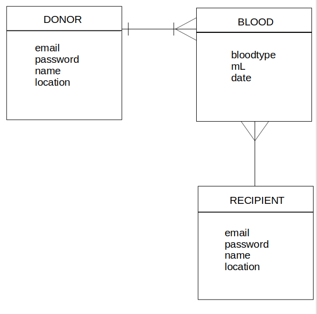

# Blood Donation App

This app allows users to help meet the constant need for blood. 

## Table of Contents

- [Team](#team)
- [Purpose](#purpose)
- [Problem](#problem)
- [User Stories](#user-stories)
- [Wireframe](#wireframe)
- [Entity Relationship Diagram](#erd)
- [Tools and Methodologies](#tools--and-methodologies)
- [Usage](#usage)

### Team

| Coder | Portfolio |
| --- | --- |
| [ncleshyne](https://github.com/ncleshyne) | ncleshyne.github.io |
| [silveredbullet](https://github.com/silveredbullet) | silveredbullet.github.io |
| [grailwilly](https://github.com/grailwilly) | silveredbullet.github.io |

### Purpose
 The app aims to help make it easier to request blood online and notify users who whould voluntary donate blood.

### Problem

  ["Michelle Maquiling, officer-in-charge of the PRC-Negros Oriental Chapter, said there is a dire need for blood donors    because there are patients who need blood every day, but there is a shortage of supply even if the DOH has programs to strengthen blood donation in the province."](http://www.philstar.com/region/2017/03/28/1685367/blood-donors-dearth-due-fear-needles)   
  ["For a first class hospital like St. Luke’s to suffer from shortage of blood supply means public hospitals are more blood-challenged nationwide from source analysed"](http://gulfnews.com/news/asia/philippines/blood-shortage-affecting-hospitals-in-philippines-1.1657914)  
  ["Blood needed: With PH blood supply below target, patients seek help online.
With the Philippines' blood supply still falling short of the target, patients in need of blood turn to online networks to look for kind-hearted strangers willing to donate"](https://www.rappler.com/newsbreak/in-depth/180446-blood-donation-online-networks-philippine-red-cross)
    
  
 
    
### User Stories

### Wireframe

### ERD

### Tools and Methodologies
* Building the App

- [Github]()
- [Cloud9](https://c9.io/)
- [Trello](https://trello.com/b/8fiwXjdl/blood-donation-app)
- [Figma](https://www.figma.com/file/VX5FDJ15HLKBLVtvVeZJ6z1w/Blood-Donation-App)

* Communication

- Slack  

- Facebook Messenger  

- Meeting  
{:height="auto" width="500px"} {:height="auto" width="500px"} {:height="auto" width="500px"}

### Usage

### Future Improvements